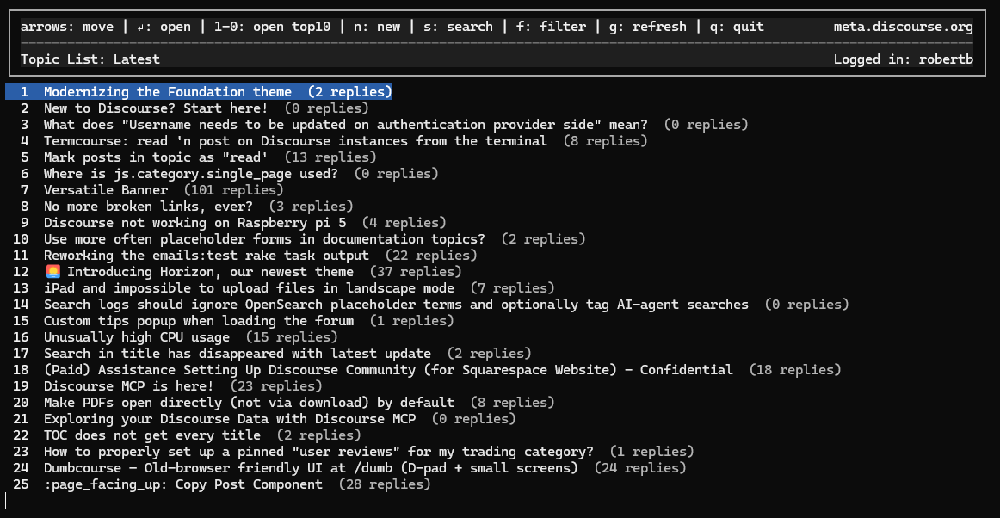

# termcourse

A terminal UI for browsing and posting to Discourse forums. It behaves like a lightweight browser client and supports reading topic lists, viewing full topics, replying, liking, and searching.

## Screenshot



## Features

- Browse latest/hot/new/unread/top topic lists.
- Read full topics with scrollable posts and a progress bar.
- Create new topics from the topic list.
- Choose a category when creating a new topic.
- Reply to topics or specific posts (Markdown supported).
- Like/unlike posts.
- Search posts and jump directly to the matching topic context.
- Inline composer with cursor movement, line breaks, and a live character counter.
- Emoji replacements for common `:emoji:` tokens and `:)`-style smiles.
- Inline image previews in expanded posts (uses `chafa`, falls back to `viu`).
- Username/email + password login (cookie-based session login; supports TOTP/backup codes).
- API key + username login (fallback for SSO-only or locked-down sites).

## Quickstart

```bash
git clone https://github.com/merefield/termcourse
cd termcourse
bundle install

# Option A: username/password login
DISCOURSE_USERNAME="you@example.com" DISCOURSE_PASSWORD="your_password" \
  bundle exec bin/termcourse https://your.discourse.host

# Option B: API key fallback
DISCOURSE_API_KEY="your_key" DISCOURSE_API_USERNAME="your_username" \
  bundle exec bin/termcourse https://your.discourse.host
```

## Auth

### Option A: Username + Password (recommended for portability)

This uses a cookie-based browser session and works across most Discourse installs that allow local login.

```bash
DISCOURSE_USERNAME="you@example.com" DISCOURSE_PASSWORD="your_password" \
  bundle exec bin/termcourse https://your.discourse.host
```

If MFA (TOTP) is enabled, you’ll be prompted for a 6-digit code. If backup codes are enabled, you can choose that method instead.

### Option B: API Key (fallback)

```bash
DISCOURSE_API_KEY="your_key" DISCOURSE_API_USERNAME="your_username" \
  bundle exec bin/termcourse https://your.discourse.host
```

## ENV

You can set any of these in your shell or `.env` file. `.env` is auto-loaded if present.

- `DISCOURSE_API_KEY`: API key for fallback auth.
- `DISCOURSE_API_USERNAME`: Username tied to the API key.
- `DISCOURSE_USERNAME`: Username or email for password login.
- `DISCOURSE_PASSWORD`: Password for password login.
- `TERMCOURSE_HTTP_DEBUG`: Set to `1` to log HTTP/auth debug responses to `/tmp/termcourse_http_debug.txt`.
- `TERMCOURSE_LINKS`: Set to `0` to disable OSC8 clickable links.
- `TERMCOURSE_IMAGES`: Set to `0` to disable inline image previews.
- `TERMCOURSE_IMAGE_BACKEND`: Choose image backend: `auto` (default), `chafa`, `viu`, or `off`.
- `TERMCOURSE_CHAFA_MODE`: Chafa render mode: `stable` (default) or `quality`.
- `TERMCOURSE_IMAGE_LINES`: Target image preview height in terminal lines (default `14`).
- `TERMCOURSE_IMAGE_QUALITY_FILTER`: Set to `0` to allow low-quality blocky previews (default filters them out).
- `TERMCOURSE_IMAGE_MAX_BYTES`: Maximum image download size per preview (default `5242880` bytes).
- `TERMCOURSE_EMOJI`: Set to `0` to disable emoji substitutions.
- `TERMCOURSE_CREDENTIALS_FILE`: Optional path to host-mapped YAML credentials. If unset, termcourse checks `./credentials.yml` first, then `~/.config/termcourse/credentials.yml`.

Auth selection order:
- CLI flags (`--username`, `--password`, `--api-key`, `--api-username`) have highest priority.
- Then host credentials from YAML using lookup order: `TERMCOURSE_CREDENTIALS_FILE` path if set, else `./credentials.yml`, else `~/.config/termcourse/credentials.yml`.
- Then generic env vars (`DISCOURSE_*`).
- If both login and API pairs are present, login is tried first unless the host entry sets `auth: api`.
- If a host entry explicitly sets `auth: login` or `auth: api`, termcourse only tries that auth method for that host.
- For username/password auth, termcourse prompts only for missing fields (for example, prompts just for password if username is already known).
- For API auth, both `api_username` and API key must resolve to non-empty values. If either is missing (including missing `*_env` target values), API login fails.

Example `.env`:

```bash
DISCOURSE_USERNAME=you@example.com
DISCOURSE_PASSWORD=your_password
```

Example `credentials.yml`:

```yaml
sites:
  acmeforum.example:
    auth: api
    api_username: system
    api_key_env: TERMCOURSE_API_KEY_ACME

  meta.discourse.org:
    auth: login
    username: you@example.com
    password_env: TERMCOURSE_PASSWORD_META
```

A ready-to-edit sample is included at `credentials.example.yml`.
An aligned env template is included at `.env.example`.

## Image Guidelines

- Image previews are shown only for the expanded post in Topic View.
- Backend selection:
- `TERMCOURSE_IMAGE_BACKEND=auto` tries `chafa` first, then `viu`.
- Set `TERMCOURSE_IMAGE_BACKEND=chafa` or `TERMCOURSE_IMAGE_BACKEND=viu` to force one backend.
- Set `TERMCOURSE_IMAGE_BACKEND=off` or `TERMCOURSE_IMAGES=0` to disable previews.
- Chafa modes:
- `TERMCOURSE_CHAFA_MODE=stable` favors stability and conservative output.
- `TERMCOURSE_CHAFA_MODE=quality` enables higher-detail/color symbol rendering.
- Height control:
- `TERMCOURSE_IMAGE_LINES` controls preview height (line count), default `14`.
- `viu` path uses line-targeted rendering to preserve aspect ratio better.
- Quality filtering:
- `TERMCOURSE_IMAGE_QUALITY_FILTER=1` (default) suppresses very noisy block-only previews.
- Set `TERMCOURSE_IMAGE_QUALITY_FILTER=0` to always show renderer output.
- Download safety:
- `TERMCOURSE_IMAGE_MAX_BYTES` limits how much data is fetched per image preview.
- Discourse `upload://...` markdown image links are resolved to `/uploads/short-url/...` automatically.
- Practical guidance for WSL/Windows Terminal:
- If `viu` looks good in your shell, force `TERMCOURSE_IMAGE_BACKEND=viu`.
- If output is unstable/noisy, use `TERMCOURSE_IMAGE_BACKEND=chafa` and tune `TERMCOURSE_CHAFA_MODE`.

## How To Use

### Topic List
- Use Up/Down arrows to navigate.
- Press Enter to open a topic.
- Press `n` to create a new topic.
- Press `s` to search.
- Press `f` to cycle the list filter (Latest, Hot, New, Unread, Top).
- Press `p` to change Top period (daily, weekly, monthly, quarterly, yearly).
- Press `g` to refresh.
- Press `q` to quit.

The status bar shows the current list filter and your logged-in username.

### Composer
- Enter inserts a new line.
- Arrow keys move the cursor within the editor.
- Backspace deletes.
- `Ctrl+D` submits.
- `Esc` cancels.

### Topic View
- Up/Down moves between posts.
- Left/Right scrolls the expanded post content.
- `l` like/unlike a post.
- `r` reply to the topic.
- `p` reply to the selected post.
- `s` search from within a topic.
- `esc` goes back to the list.
- `q` quits.

The bottom bar shows your position in the topic (current/total).

### Search
- Press `s` to open search.
- Type your query; Enter runs the search.
- Arrow keys move through results; Enter opens the topic at the matching post.

## Debug & Logging

- HTTP debug logs are **opt-in**: set `TERMCOURSE_HTTP_DEBUG=1`.
- Logs are written to `/tmp/termcourse_http_debug.txt`.
- Logs may include usernames and server responses. Disable when not needed and delete after use.

## Security

- **Prompt-based login is supported by default** when no full credential pair is found in env/flags, which avoids putting passwords on the command line.
- **Session cookies are in-memory only.** The app does not write cookies to disk; closing the app ends the session on this client.
- **No password storage.** Credentials are only used for the login request and are not persisted by the app.
- **Some sites disable local login.** If a site requires SSO or blocks scripted login, use an API key or a dedicated test account.
- **MFA support is limited to TOTP/backup codes.** Hardware keys (WebAuthn/passkeys) are not supported in terminal mode.

## Notes

- Replies support Markdown.

## Troubleshooting

- If a site returns login errors with MFA enabled, ensure TOTP is configured and enter a fresh 6-digit code when prompted.
- If both login and API env pairs are set, username/password is used first.
- On some networks (often macOS with broken IPv6 routes), the client may time out on initial requests. Termcourse automatically retries once over IPv4 and will stick to IPv4 for the remainder of the session after the first timeout.
