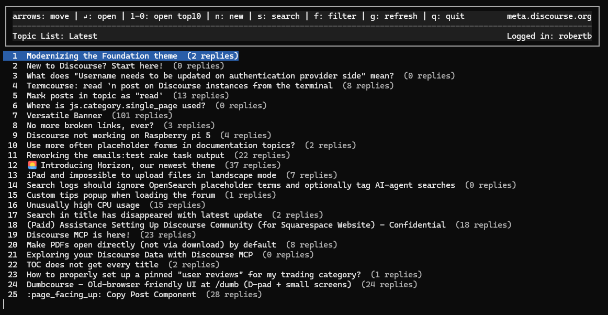

# termcourse

Termcourse is a Go 1.26.6 terminal UI for browsing and posting to Discourse forums. This version replaces the original Ruby implementation while retaining its browsing, posting, realtime, rendering, localization, theming, and image features.

## Screenshot



## Features

- Browse Latest, Unread, Private Messages, Hot, New, and Top topic lists.
- Cycle Top periods: daily, weekly, monthly, quarterly, and yearly.
- Paginated compact/category/stats layouts, including PM-specific users/replies columns.
- Read complete topics with lazy post-stream loading, scrolling, read-state updates, and a progress footer.
- Create topics, select categories, reply to topics or posts, and like/unlike posts.
- Search posts and open the matching post context.
- Browse/filter notifications and jump to their topic/post.
- Cookie login with username/password, TOTP, or backup codes.
- API-key fallback for sites where browser login is unsuitable.
- MessageBus list/topic updates, notification and PM badges, resume positions, and watchdog recovery for cookie sessions.
- Inline multiline composer with cursor movement, line breaks, character validation, submit/cancel controls.
- Built-in English, French, German, and Spanish UI translations.
- Built-in `default`, `slate`, `fairground`, `rust`, and `hacker` themes plus YAML overrides.
- Truecolor, 256-color, and 16-color output.
- GFM Markdown rendering (including lists, quotes, code, tasks, and tables), OSC8 links, emoji substitution, and ANSI/grapheme-aware sizing.
- High-quality inline/fullscreen images through Kitty Unicode placements, with colored `chafa` symbols (or `viu`) as the portable fallback and explicit size/quality limits.
- Incremental screen repainting and resize-responsive layouts, with a compact branded masthead, wide-terminal logo, rounded titled panels, and themed block gauges.

## Build

Go 1.26.6 or newer is required.

```sh
go build ./cmd/termcourse
go test ./...
```

Install directly:

```sh
go install github.com/merefield/termcourse/cmd/termcourse@latest
```

## Quick start

Username/password login (enables realtime MessageBus updates):

```sh
DISCOURSE_USERNAME="you@example.com" \
DISCOURSE_PASSWORD="your_password" \
./termcourse --theme slate --lang fr https://your.discourse.host
```

API-key login (HTTP features only):

```sh
DISCOURSE_API_KEY="your_key" \
DISCOURSE_API_USERNAME="your_username" \
./termcourse --theme fairground https://your.discourse.host
```

List the built-in and configured themes, or preview one theme:

```sh
./termcourse themes
./termcourse themes hacker
```

A local `.env` is loaded automatically. CLI credentials override host credentials from YAML, which override generic environment variables. If both login and API pairs exist, login is tried first unless the host entry selects `auth: api`.

## Configuration

The program looks for host credentials in:

1. `TERMCOURSE_CREDENTIALS_FILE`
2. `./credentials.yml`
3. `~/.config/termcourse/credentials.yml`

See [credentials.example.yml](credentials.example.yml) and [.env.example](.env.example).

Theme selection uses the first available value:

1. `--theme NAME`
2. `TERMCOURSE_THEME`
3. The `theme:` value in the theme file
4. `default`

The five built-in themes are `default`, `slate`, `fairground`, `rust`, and `hacker`; they work without any files. Theme files are loaded from `--theme-file PATH`, then `TERMCOURSE_THEME_FILE`, then the platform user configuration directory (`~/.config/termcourse/theme.yml` on Linux). The launch directory is deliberately not consulted.

See [theme.example.yml](theme.example.yml) for partial built-in overrides and custom themes. Supported keys are `primary`, `background`, `highlighted`, `highlighted_text`, `borders`, `bar_backgrounds`, `separators`, `list_numbers`, `list_text`, `post_username`, `list_meta`, and `accent`. Colors accept `#rrggbb`, indexes `0`–`255`, `black`, `white`, `red`, `green`, `blue`, `yellow`, `cyan`, `magenta`, `gray`/`grey`, or `none`. Invalid fields, colors, files, and theme names produce actionable errors.

### Environment

| Variable | Purpose |
| --- | --- |
| `DISCOURSE_USERNAME`, `DISCOURSE_PASSWORD` | Cookie login credentials. |
| `DISCOURSE_API_KEY`, `DISCOURSE_API_USERNAME` | API authentication fallback. |
| `TERMCOURSE_CREDENTIALS_FILE` | Credentials YAML override. |
| `TERMCOURSE_THEME`, `TERMCOURSE_THEME_FILE` | Theme name/file; overridden by `--theme` and `--theme-file`. |
| `TERMCOURSE_LANG` | `en`, `fr`, `de`, or `es`; then `LC_ALL`, `LC_MESSAGES`, `LANG`. |
| `TERMCOURSE_COLOR_MODE` | `auto`, `truecolor`, `256`, or `16`; auto detects output capabilities. |
| `TERMCOURSE_LINKS`, `TERMCOURSE_EMOJI` | Set to `0` to disable. |
| `TERMCOURSE_IMAGES` | Set to `0` to disable previews. |
| `TERMCOURSE_IMAGE_PROTOCOL` | `auto`, `kitty`, or `symbols`; auto probes Kitty and falls back safely. |
| `TERMCOURSE_IMAGE_BACKEND` | `auto`, `chafa`, `viu`, or `off`. |
| `TERMCOURSE_IMAGE_MODE` | `compat`, `balanced` (default), or `high` for symbol fallback. |
| `TERMCOURSE_IMAGE_COLORS` | `auto`, `none`, `16`, `240`, `256`, or `full`. |
| `TERMCOURSE_IMAGE_COLUMNS`, `TERMCOURSE_IMAGE_LINES` | Maximum thumbnail size, defaults 48×6 cells. |
| `TERMCOURSE_IMAGE_MAX_BYTES` | Per-image limit, default 5,242,880. |
| `TERMCOURSE_IMAGE_QUALITY_FILTER` | Set to `0` to allow noisy previews. |
| `TERMCOURSE_TICK_MS` | Input/resize poll interval, default 100ms. |
| `TERMCOURSE_HTTP_DEBUG` | HTTP log in the system temp directory. |
| `TERMCOURSE_DEBUG`, `TERMCOURSE_IMAGE_DEBUG` | UI/image diagnostics in the system temp directory. |

## Controls

Topic list:

- Arrows move; Enter or `1`–`0` opens.
- `c` creates, `n` opens notifications, `s` searches.
- `f` cycles filters; `p` cycles Top periods.
- `g` refreshes; `q` quits.

Topic view:

- Up/Down selects posts; Left/Right scrolls the expanded post.
- `l` toggles like; `r` replies to the topic; `p` replies to the post.
- `s` searches; `n` opens notifications; `x` opens an image.
- Escape/Backspace goes back; `q` quits.

Composer:

- Enter adds a line; arrows move; Backspace deletes.
- Ctrl+D submits; Escape cancels.

Notifications and search use arrows, Enter to open, Escape to return, and `q` to quit. Notifications use `f` to cycle filters.

## Authentication notes

Realtime updates require a browser-style cookie session, so they are enabled after username/password login. API-key mode retains all HTTP operations but intentionally does not create a realtime session. Login auth follows Discourse's CSRF/cookie flow and prompts for TOTP or backup codes when the server requests a second factor.

## Implementation

The interface runs on the current Charm v2 stack. Bubble Tea owns raw mode, the alternate screen, synchronized incremental rendering, resize events, cursor state, terminal queries, color downsampling, window metadata, and supported native progress metadata. Bubbles supplies the themed single-line editor and multiline composer, including bracketed paste, word navigation, soft wrapping, cursor behavior, and viewport scrolling. Lip Gloss v2 provides pure theme/layout styles, while Glamour v2/Goldmark renders GFM and `x/ansi` provides ANSI-safe grapheme measurement, truncation, Kitty graphics encoding, capability responses, and virtual image placement. `x/term` remains limited to pre-TUI password input, terminal detection, and sizing fallback.

The Discourse MessageBus client remains protocol-specific because MessageBus uses chunk-framed HTTP long polling rather than WebSockets. Its lifecycle and resume semantics remain domain code, while terminal I/O is delegated to Bubble Tea.
